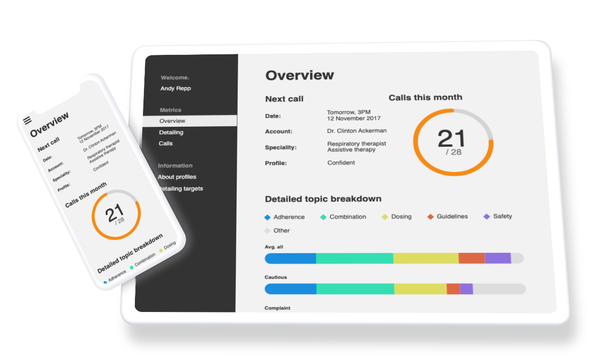

# twentyeightb Project

## Screenshot

## Reflection

### What went well?

I was able to replicate the brief accurately including all components, fonts and interaction without the use of a library.

This means the screen is fast to load, bespoke and unhindered by any third-party nuances/bugs.

### What did you enjoy?

I really enjoyed the challenge of building the bar charts & donut element logic using vanilla JS & CSS. It taught me much more than I thought it would and I impressed myself with how much I could achieve without a library.

If I had used a library I may not have ran into as much research and learning opportunities.

### Where was the challenge in the task?

- Building the logic to populate `flex-basis` and the `data-tooltip` attribute to make each bar's data dynamic.
- I wanted the random data to populate 6 bars to a maximum of 100% (probably no necessary but I did it anyway). Building a loop that would generate 4 arrays of dummy data totaling 100 took a lot of testing: `console.log` and `.reduce` came to the rescue.
- Making sure the sidebar behaved smoothly across devices - I ran into problems that would cause users to lose the burger menu if they were to open the menu and then resize their window (e.g mobile portrait to landscape).

### What learnings will you carry forward?

- Inline `stroke-dasharray` attributes on SVGs can be hacked to make an animated donut (this is still a bit magic to me).
- When building elements with JavaScript, be more mindful when assigning `.style` attributes over using `classList.add`. It will prevent yourself tripping over CSS specificity, classes give more control.
- Sometimes it pays to build something without a library, sometimes it doesn't. Being clear on that decision is important.

### What might you do differently next time as well as any other reflections you would like to share.

- Given more time i'd like to explore a charts library such as [Charts.js](https://www.chartjs.org/) or [Echarts](https://echarts.apache.org/en/index.html) to see if I could improve the readability of my code for other developers.
- I am certain I could code more efficiently here.
- Use of a charts framework may have made my life much easier and been more intuitive to use for other child/parent screens.
- I could have also used a CSS framework to speed up the build. For example, [Bootstrap](https://mdbootstrap.com/) has components and behaviour already tested for collapsible sidebars and it has chart capabilities - I spent a lot of time testing my charts and sidebar which may not have been necessary with Bootstrap components.
